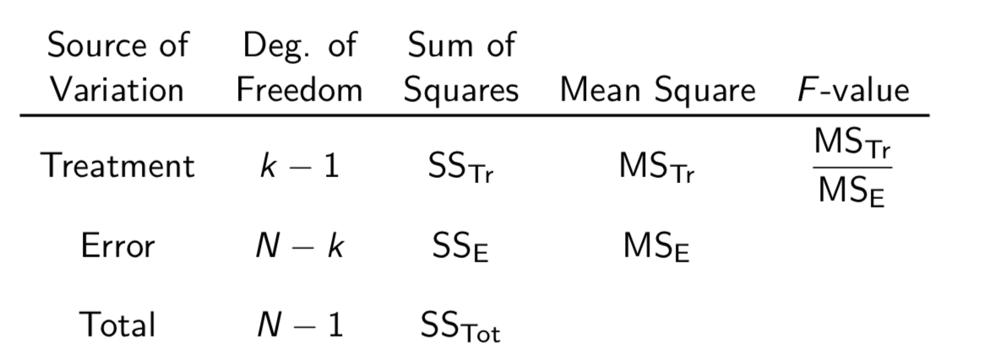

- Multiple linear regression
- Analysis of variance

##Multiple linear regression

#### General Regression Models

- multilinear model
  $$
  \mu_{Y | x_{1}, \ldots, x_{p}}=\beta_{0}+\beta_{1} x_{1}+\cdots+\beta_{p} x_{p}
  $$

- polynomial model of degree $p$
  $$
  \mu_{Y | x}=\beta_{0}+\beta_{1} x+\beta_{2} x^{2}+\cdots+\beta_{p} x^{p}
  $$

##### Goal: 

minimize $\mathrm{SSE}=\sum_{i=1}^{n} e_{i}^{2}=\sum_{i=1}^{n}\left(y_{i}-\left(b_{0}+b_{1} x_{i}+\cdots+b_{p} x_{i}^{p}\right)\right)^{2}$.

---

#### Minimize SSE

In matrix form, 
$$
Y=\left(\begin{array}{c}{Y_{1}} \\ {\vdots} \\ {Y_{n}}\end{array}\right), \quad X=\left(\begin{array}{ccccc}{1} & {x_{1}} & {x_{1}^{2}} & {\ldots} & {x_{1}^{p}} \\ {\vdots} & {\vdots} & {\vdots} & {\ddots} & {\vdots} \\ {1} & {x_{n}} & {x_{n}^{2}} & {\ldots} & {x_{n}^{p}}\end{array}\right), \beta=\left(\begin{array}{c}{\beta_{0}} \\ {\vdots} \\ {\beta_{p}}\end{array}\right), E=\left(\begin{array}{c}{E_{1}} \\ {\vdots} \\ {E_{n}}\end{array}\right)
$$

$$
\begin{aligned} \mathrm{SSE} &=\langle Y-X b, Y-X b\rangle \\ &=\|Y\|^{2}-2\langle X b, Y\rangle+\|X b\|^{2} \end{aligned}
$$
To obtain minimum $SSE$, set $\nabla_{b} \mathrm{SSE} = 0$.
$$
b=\left(X^{T} X\right)^{-1} X^{T} Y
$$

---

#### Error Analysis

Total variation: $S_{y y}=\sum_{i=1}^{n}\left(Y_{i}-\overline{Y}\right)^{2}$, in matrix form,
$$
\begin{aligned} S_{y y} &=\left\langle Y,\left(\mathbb{1}_{n}-P\right) Y\right\rangle \\ &=\underbrace{\left\langle Y,\left(\mathbb{1}_{n}-H\right) Y\right\rangle}_{=S S E}+\underbrace{\langle Y,(H-P) Y\rangle}_{=SSR} \end{aligned}
$$
Decomposition: $S_{y y}=\mathrm{SSR}+\mathrm{SSE}$

1. $SSR$ regression sum of squares, variation of response (predicted by the regressiom model). 
   - $\sum_{i=1}^{n}\left(\hat{y}_{i}-\overline{y}\right)^{2}$.
2. $SSE$ deviation of response from model
   - $\sum_{i=1}^{n}\left(y_{i}-\hat{y}_{i}\right)^{2}$

Coefficient of multiple determination: $R^{2}=\frac{\mathrm{SSR}}{S_{y y}}$, proportion of response variation in $Y$ explained by model.

---

#### Distribution of $SSE$ and $SSR$

- Chi-squared distribution of $n-p-1$ degrees of freedom:
  $$
  \frac{SSE}{\sigma^2}
  $$

- If $\beta=\left(\beta_{0}, 0, \ldots, 0\right)$, chi-squared distribution of $p$ degrees of freedom:
  $$
  \frac{SSR}{\sigma^2}
  $$

$SSR$ and $SSE$ are independent random variables.

$\mathrm{SSR}=\langle X b, Y\rangle-\frac{1}{n}\left(\sum_{i=1}^{n} Y_{i}\right)^{2}$

- unbiased estimator for $\sigma^2$:
  $$
  \widehat{\sigma}^{2} :=S^{2} :=\frac{\mathrm{SSE}}{n-p-1}
  $$

---

#### F-Test for Significance of Regression

Null hypothesis: 
$$
H_{0} : \beta_{1}=\beta_{2}=\ldots=\beta_{p}=0
$$
rejected in favor of
$$
H_{1} : \beta_{j} \neq 0 \quad \text { for at least one } j=1, \ldots, p
$$
at significance level $\alpha$ if 
$$
F_{p, n-p-1}=\frac{\operatorname{SSR} / p}{\operatorname{SSE} /(n-p-1)}=\frac{\operatorname{SSR} / p}{S^{2}} =\frac{n-p-1}{p} \frac{R^{2}}{1-R^{2}}
$$
satisfies $F_{p, n-p-1}>f_{\alpha, p, n-p-1}$.

---

#### Estimate mean

$$
\begin{aligned} \hat{\mu}_{Y| x_{10}, \ldots, x_{p 0}} &=\hat{\beta}_{0}+\hat{\beta}_{1} x_{10}+\cdots+\hat{\beta}_{p} x_{p 0} \\ &=x_{0}^{T} \hat{\beta} \\ &=x_{0}^{T}\left(X^{T} X\right)^{-1} X^{T} Y \end{aligned}
$$

Mean and variance:
$$
\begin{array}{c}{\mathrm{E}\left[\hat{\mu}_{Y | x_{10}, \ldots, x_{p 0}}\right]=\mathrm{E}\left[x_{0}^{T} \hat{\beta}\right]=x_{0}^{T} \mathrm{E}[\hat{\beta}]=x_{0}^{T} \beta} \\ {\operatorname{Var} \hat{\mu}_{Y | x_{10}, \ldots, x_{p 0}}=x_{0}^{T}(\operatorname{Var} \hat{\beta}) x_{0}=\sigma^{2} x_{0}^{T}\left(X^{T} X\right)^{-1} x_{0}}\end{array}
$$

- T-distribution with $n-p-1$ degrees of freedom
  $$
  \frac{\hat{\mu}_{Y| x_{10}, \ldots, x_{p 0}}-\mu_{Y | x_{10}, \ldots, x_{p 0}}}{S \sqrt{x_{0}^{T}\left(X^{T} X\right)^{-1} x_{0}}}
  $$

- $100(1-\alpha)\%$ confidence interval: 

  $\mu_{Y | x_{10}, \ldots, x_{p 0}}=\hat{\mu}_{Y| x_{10}, \ldots, x_{p 0}} \pm t_{\alpha / 2, n-p-1} S \sqrt{x_{0}^{T}\left(X^{T} X\right)^{-1} x_{0}}$

- $100(1-\alpha)\%$ prediction interval: 
  $$
  Y | x_{10}, \ldots, x_{p 0}=\hat{\mu}_{Y | x_{10}, \ldots, x_{p 0}} \pm t_{\alpha / 2, n-p-1} S \sqrt{1+x_{0}^{T}\left(X^{T} X\right)^{-1} x_{0}}
  $$

---

#### Estimate Parameters of LSE

$\hat{\beta}$ follows a normal distribution with mean $\beta$ and variance-covariance matrix $\sigma^2(X^TX)^{-1}$.
$$
\begin{aligned} \operatorname{Var} \hat{\beta} &=\operatorname{Var}\left(\left(X^{T} X\right)^{-1} X^{T} Y\right) \\ &=\left(X^{T} X\right)^{-1} X^{T} \operatorname{Var}(Y)\left(\left(X^{T} X\right)^{-1} X^{T}\right)^{T} \\ &=\sigma^{2}\left(X^{T} X\right)^{-1} X^{T}\left(\left(X^{T} X\right)^{-1} X^{T}\right)^{T} \\ &=\sigma^{2}\left(X^{T} X\right)^{-1} \end{aligned}
$$
The estimators $b_0$, … $b_p$ are **NOT** independent of each other.

- Standard normal distribution:

$$
Z=\frac{\hat{\beta}_{j}-\beta_{j}}{\sigma \sqrt{c_{jj}}}
$$

- T-distribution of $n-p-1$ degrees of freedom:

$$
\frac{\left(\hat{\beta}_{j}-\beta_{j}\right) /\left(\sigma \sqrt{c_{j j}}\right)}{\sqrt{(n-p-1) S^{2} / \sigma^{2} /(n-p-1)}}=\frac{\hat{\beta}_{j}-\beta_{j}}{S \sqrt{c_{j j}}}
$$

- $100(1-\alpha)\%$ confidence interval: $\beta_{j}=\hat{\beta}_{j} \pm t_{\alpha / 2, n-p-1} S \sqrt{c_{j j}}$.

------

#### T-Test on Model Parameters

For a fitted model $\mu_{Y | x_{1}, \ldots, x_{p}}=\beta_{0}+\beta_{1} x_{1}+\cdots+\beta_{p} x_{p}$, for any $j = 0, …,p$
$$
H_{0} : \beta_{j}=0 \quad \text { is rejected in favor of } \quad H_{1} : \beta_{j} \neq 0
$$
at significance level $\alpha$ if
$$
T_{n-p-1}=\frac{\hat{\beta}_{j}}{S \sqrt{C_{j j}}}
$$
satisfies $\left|T_{n-p-1}\right|>t_{\alpha / 2, n-p-1}$.

---

#### model sufficiency and reduced model

A reduced model of $m+1<p+1$:
$$
\mu_{Y | x_{1}, \ldots, x_{m}}=\tilde{\beta}_{0}+\tilde{\beta}_{1} x_{1}+\cdots+\tilde{\beta}_{m} x_{m}
$$

- $\mathrm{SSE}_{\mathrm{full}} =\text { sum of squares error } \mathrm{SSE} \text { for full model, }$

- $\mathrm{SSE}_{\text { reduced }} =\text { sum of squares error SSE for reduced model. }$

**Partial F-Test**: $H_{0} : \text { the reduced model is sufficient }$ is rejected in favor of $H_{1} : \text { the full model is needed }$ at significance level $\alpha$ if test statistic
$$
F_{p-m, n-p-1}=\frac{n-p-1}{p-m} \frac{\mathrm{SSE}_{\mathrm{reduced}}-\mathrm{SSE}_{\mathrm{full}}}{\mathrm{SSE}_{\mathrm{full}}}
$$
satisfies $F_{p-m, n-p-1}>f_{\alpha, p-m, n-p-1}$.

T-test for a single variable is equivalent to a partial F-test when reduce only a single variable.

---

#### Indicator variables

Number of possibilities for a qualitative variable are called levels. To model $l$ levels need $l-1$ indicator variables.
$$
\left(x_{2}, x_{3}\right)=\left\{\begin{array}{ll}{(0,0)} & {\text { type } A \text { used }} \\ {(1,0)} & {\text { type } B \text { used }} \\ {(0,1)} & {\text { type } C \text { used. }}\end{array}\right.
$$

---

#### Model selection

1. forward model selection add until we cannot reject null hypothsis.
2. backward model selection: delete until we can reject null hypothsis.
3. stepwise method: recheck in every step

**NOT** necessarily yield identical model.

---

#### Nonlinear models

- Exponential model: $\mu_{Y | x}=\beta_{0} e^{\beta_{1} x}$,  $x>0$.

$$
\ln y_{i}=\ln \beta_{0}+\beta_{1} x_{i}+\ln e_{i}, \quad \Leftrightarrow \quad y_{i}^{*}=\beta_{0}^{*}+\beta_{1} x_{i}+e_{i}^{*}
$$

- Power model: $\mu_{Y | x}=\beta_{0} x^{\beta_{1}}$, $x>0$.

  $\ln y_{i}=\ln \beta_{0}+\beta_{1} \ln x_{i}+\ln e_{i}, \quad \Leftrightarrow \quad y_{i}^{*}=\beta_{0}^{*}+\beta_{1} x_{i}^{*}+e_{i}^{*}$

- Reciprocal model: $\mu_{Y | x}=\beta_{0}+\beta_{1} / x$, $x>0$

  $y_{i}=\beta_{0}+\beta_{1} x_{i}^{*}+e_{i}, \quad x_{i}^{*}=1 / x_{i}$

---

## Analysis of Variance (ANOVA)

#### ANOVA: comparison of means of multiple populations

- single-factor experiment vs. multifactor experiment
- populations: levels / treatments
- one-way classification fixed-effects model

---

#### One-way classification fixed-effects model

1. $k$ populations with some common characteristic to be studied. Select an independent random sample from each population.
2. $N$ homogeneous experimental units, study effects of $k$ different treatments. Divide into $k$ subgroups, each receive a different treatment.

Test:
$$
H_{0} : \mu_{1}=\cdots=\mu_{k}, \quad H_{1} : \mu_{i} \neq \mu_{j} \text { for some } 1 \leq i<j \leq k
$$

---

#### Notation

---

#### Model

$$
Y_{i j}=\mu_{i}+E_{i j}=\mu+\alpha_{i}+E_{i j}
$$

Null hypothesis: $H_{0} : \mu_{1}=\mu_{2}=\cdots=\mu_{k}$ is equivalent to $H_{0} : \alpha_{1}=\alpha_{2}=\cdots=\alpha_{k}=0$.

##### Assumption

$E_{ij}$ are independent, normally distributed, mean 0 and common variance $\sigma^2$.
$$
\underbrace{\sum_{i=1}^{k} \sum_{j=1}^{n_{i}}\left(Y_{i j}-\overline{Y} . .\right)^{2}}_{\text {SS}_{\text {Tot}}} = \underbrace{\sum_{i=1}^{k} n_{i}\left(\overline{Y}_{i}-\overline{Y}_{ . .}\right)^{2}}_{\text { SS}_{\text {Tr }}} +\underbrace{\sum_{i=1}^{k} \sum_{j=1}^{n_{i}}\left(Y_{i j}-\overline{Y}_{i .}\right)^{2}}_{\mathrm{SS}_{E}} 
$$

- $\mathrm{SS}_{\mathrm{Tr}}$ variability due to different treatment
- $\mathrm{SS}_{\mathrm{E}}$ variability due to random fluctuation

If there is an intrinsic different in the means, $SS_{Tr}$ should be significantly larger than $SS_E$.

---

#### ANOVA F-Test

Normally distributed random variables $Y_{1}, \ldots, Y_{k}$, samples satisfy $N=n_{1}+\cdots+n_{k}$. Reject 
$$
H_{0} : \mu_{1}=\mu_{2}=\cdots=\mu_{k}
$$
in favor of 
$$
H_{1} : \mu_{i} \neq \mu_{j} \text { for at least one pair }(i, j), 1 \leq i<j \leq k
$$
at significance level $\alpha$ if
$$
F_{k-1, N-k}=\frac{\mathrm{MS}_{\mathrm{Tr}}}{\mathrm{MS}_{\mathrm{E}}} > f_{\alpha, k-1, N-k}
$$

---

#### ANOVA table

---

#### Bartlett's Test for equality of variances

Reject
$$
H_{0} : \sigma_{1}^{2}=\cdots=\sigma_{k}^{2}
$$
in favor of 
$$
H_{1} : \sigma_{i}^{2} \neq \sigma_{j}^{2} \text { for at least one pair }(i, j), 1 \leq i<j \leq k
$$
at significance level $\alpha$ if $B=\frac{Q}{h} > \chi_{\alpha, k-1}^{2}$.

---

