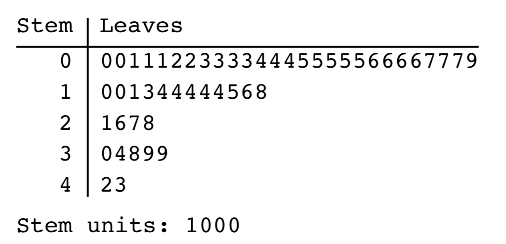
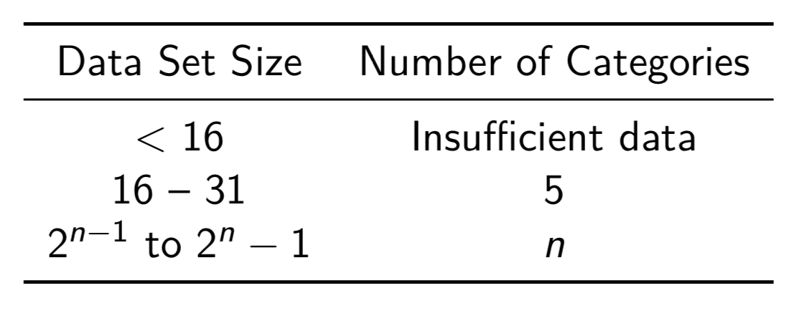
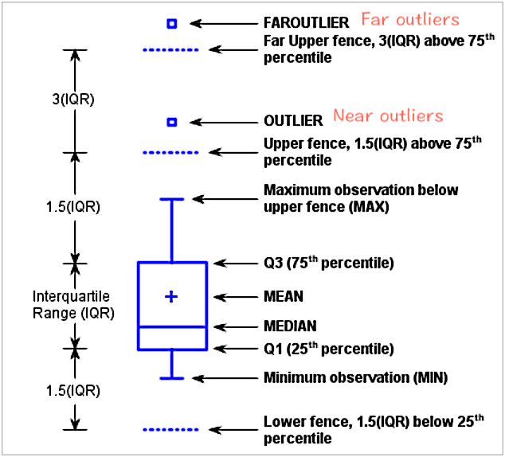

## Statistical Methods

### Descriptive Statistics

- Population
- Random variable
- Sample, subset of population, object being studied

In order to guarantee that the the random variables in a random sample are indeed independently distributed, the size of the random sample should not exceed  **5%** of the population. 

#### Sample Statistics

Random variable derived from a random sample.

- sample range
  $$
  \max _{1 \leq k \leq n} X_{k}-\min _{1 \leq k \leq n} X_{k}
  $$

- sample mean: estimate of $E[X]$.
  $$
  \overline{X} :=\frac{1}{n} \sum_{k=1}^{n} X_{k}
  $$

- sample median
  $$
  \widetilde{x}=\left\{\begin{array}{ll}{\frac{1}{2}\left(x_{n / 2}+x_{n / 2+1}\right)} & {n \text { even }} \\ {x_{(n+1) / 2}} & {n \text { odd }}\end{array}\right.
  $$
  *Re-indexing*!

- sample variance
  $$
  S^{2}=\frac{1}{n-1} \sum_{k=1}^{n}\left(X_{k}-\overline{X}\right)^{2}
  $$

  > **Bessel's correction and degree of freedom**
  > *Bessel's correction* is the use of $n − 1$ instead of *n* in the formula for the sample variance and sample standard deviation, where $n$ is the number of observations in a sample. This method corrects the bias in the estimation of the population variance.
  >
  > $\left(x_{1}-\overline{x}, \ldots, x_{n}-\overline{x}\right)$ has only $n-1$ indepenent terms because they sum to 0.

- sample standard deviation
  $$
  S :=\sqrt{S^{2}}
  $$

#### Rounding statistics

- **range** and **median**: not rounded
- **mean** and **standard deviation**: one more decimal place than the original data
- **variance**:  two more decimal places than the original data

#### Visualization

##### Stem-and-Leaf diagram

double stem-and-leaf plot

##### Histograms

- Sturges's rule

  

  - data range
  - cateogry length (round up to the accuracy of the data or add a smallest decimal unit if already at accuracy)
  - lower boundary lies 1/2 decimal unit below smallest datum (to avoid a boundary value)

##### Ogive

Cumulative frequency plot. Approximate the cumulative distributive function $F$ for a continuously distributed random variable.

##### Box plot

Used for checking if data follows a normal distribution.

> **Percentiles and Quartiles** are introduced in box plot: the $x$ th percentile is defined as **the value $d_x$ of the data** such that $x\%$ of the values of the data are less than or equal to  $d_x$. 
>
> $q_1$, $q_2$, $q_3$: 25%, 50%, 75% of the data are no greater than the first/second/third quartile

- interquatile range: $\text { iqr } :=q_{3}-q_{1}$.

- inner fences
  $$
  f_{1}=q_{1}-\frac{3}{2} \mathrm{iqr}, \qquad f_{3}=q_{3}+\frac{3}{2} \mathrm{iqr}
  $$

- adjacent values
  $$
  a_{1}=\min \left\{x_{k} : x_{k} \geq f_{1}\right\}, \qquad a_{3}=\max \left\{x_{k} : x_{k} \leq f_{3}\right\}
  $$

- outer fences
  $$
  F_{1}=q_{1}-3 \mathrm{iqr}, \quad F_{3}=q_{3}+3 \mathrm{iqr}
  $$

Outliers: 7 out of 1000.

### Estimation

The process of using statistics to approximate parameters of a random variable.

- estimator $\bf\widehat{\theta}$ and estimate
  An estimator for a population parameter $\theta$ is a statistic and denoted by $\widehat{\theta}$. Any given value of $\widehat{\theta}$ is called an estimate.

- bias of an estimator
  $$
  \theta-\mathrm{E}[\widehat{\theta}]
  $$
  unbiased: $\mathrm{E}[\widehat{\theta}]=\theta$.
  mean square error: $\operatorname{MSE}(\widehat{\theta}) :=\mathrm{E}\left[(\widehat{\theta}-\theta)^{2}\right]$.
  $$
  \operatorname{MSE}(\widehat{\theta})=\mathrm{E}\left[(\hat{\theta}-\mathrm{E}[\widehat{\theta}])^{2}\right]+(\theta-\mathrm{E}(\widehat{\theta}))^{2}=\operatorname{Var} \widehat{\theta}+(\mathrm{bias})^{2}
  $$

##### Sample mean $\overline{X}$

- $\mathrm{E}[\overline{X}]\ = mu$.
- $\operatorname{Var} \overline{X}=\mathrm{E}\left[(\overline{X}-\mu)^{2}\right]=\frac{\sigma^{2}}{n}$
- Standard error of mean (standard deviation of $\overline{X}$): $\sqrt{\operatorname{Var} \overline{X}}=\sigma / \sqrt{n}$

##### Sample variannce

$$
S^{2}=\frac{1}{n-1} \sum_{k=1}^{n}\left(X_{k}-\overline{X}\right)^{2}
$$

### Finding estimators

##### Method of moments

$$
\mathrm{E}[X] = M_1, \qquad \operatorname{Var} X=\mathrm{E}\left[X^{2}\right]-\mathrm{E}[X]^{2}=M_2-M_1^2
$$

##### Method of Maximum likelihood
Likelihood function
$$
L(\theta)=\prod_{i=1}^{n} f\left(x_{i}\right)
$$
Estimator $\widehat{\theta}\left(x_{1}, \ldots, x_{n}\right)$ acquires from condition $L(\widehat{\theta})=\max$.
*Log likelihood function*.

##### Example: estimating the maximum number of a consecutive discrete series

Suppose the discrete series is $\{1, 2, 3, … n\}$ and each appears with equal probability. Now a given sample is $\{1, 2, 96\}$. 

- Using the method of moments,
  $$
  E[X] = \frac{1+n}{2}\text{, an estimation is given by }n = 2\overline{X}-1
  $$
  In our case, $\hat{n} = 2\times 33 - 1 = 65$. However this is ridiculous since there is already 96 in the sample.

- Using the method of maximum likelihood, we could first write $f(x)$ as 
  $$
  f(x) =\left\{
  \begin{array}{ll}
  {\frac{1}{n}} & {x \leq n} \\
  0 & {x > n}
  \end{array}
  \right.
  $$
  *$1/n$ when $x\leq n$ comes from the fact that each element from the series appears with equal probability*.

  Therefore, to give maximum $L(n)$, we want our $\prod_i f(x_i)$ to be as large as possible. Since the sample size is fixed, this can be achieved by making $n$ as close to $\max x$ as possible, in our case, $\overline{n} = 96$. However, intuitively this is also not a proper solution.

#### Distribution of sample mean

Let $ X $  and $Y$ be two random variables with moment generating functions $m_{X}$ and $m_{Y}$, respectively. If $m_{X}(t)=m_{Y}(t)$ for all $t $ in a neighborhood of zero, then $f_{X}(x)=f_{Y}(x)$ for all $x$.

Let $X_{1}, \ldots, X_{n}$ be a random sample of size $n$ from a normal distribution with mean $\mu$ and variance $\sigma^{2}$, then $\overline{X}$ is normally distributed with mean $\mu$ and variance $\sigma^{2} / n$.

#### Interval estimation

- two-sided confidence interval

  $0 \leq \alpha \leq 1$, a $100(1-\alpha) \%$ two-sided confidence interval for a parameter $\theta$ is an interval $\left[L_{1}, L_{2}\right]$ such that $P\left[L_{1} \leq \theta \leq L_{2}\right]=1-\alpha$. If it is a centered confidence interval, $P\left[\theta<L_{1}\right]=P\left[\theta>L_{2}\right]=\alpha / 2$.

- one-sided confidence interval
  $100(1-\alpha) \%$ upper confidence bound $P[\theta \leq L]=1-\alpha$, lower confidence bound $P[L \leq \theta]=1-\alpha$.

- interval estimation with variance known
  $$
  Z=\frac{\overline{X}-\mu}{\sigma / \sqrt{n}}
  $$
  For a normal distribution with **known variance** $\sigma^2$, a $100(1-\alpha) \%$ confidence interval on $\mu$ is 
  $$
  \overline{X} \pm \frac{z_{\alpha / 2} \cdot \sigma}{\sqrt{n}}
  $$

### Central limit theorem

$X_{1}, \ldots, X_{n}$ are independent random variables with $arbitrary distributions$, $Y=X_{1}+\cdots+X_{r}$, $\mathrm{E}\left[X_{j}\right]=\mu_{j}$ and $\operatorname{Var} X_{j}=\sigma_{j}^{2}$, under some general conditions
$$
Z_{n}=\frac{Y-\sum \mu_{j}}{\sqrt{\sum \sigma_{j}^{2}}}
$$
is approximately standard-normally distributed as $n$ becomes large.

If random variables $X_{1}, \ldots, X_{n}$ follow the same distribution with mean $\mu$ and variance $\sigma^2$, $\overline{X}$ is approximately normal with mean $\mu$ and variance $\sigma^{2} / n$.
$$
Z_{n}=\frac{\overline{X}-\mu}{\sigma / \sqrt{n}}
$$

